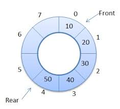

# CSCI 1102 Computer Science 2

### Spring 2018

------

## Lecture Notes

### Week 4: The Queue ADT

#### Topics:

1. The Generic Queue ADT: Sequential Representation
2. The Generic Queue ADT: Linked Representation
3. Deques - Double-Ended Queues
---

## 1. The Generic Queue ADT: Sequential Representation

##### Intuition

Think of a line for tickets at the theater

```
         enq(A)       enq(B)        enq(C)           dequeue() returns A
    --   =====>  A -- =====> A B -- =====> A B C --  =======>  B C --
                                           ^   ^
                                   front --+   +-- back
```

We assume known the basic First-In-First-Out (FIFO) behavior of queues. 

```java
public interface Queue<T> {
  void enqueue(T item);
  T dequeue();
  T peek();
  boolean isEmpty();
  int size();
  String toString();
}
```

The Java code in the `src/queues` directory has both sequential and linked implementations.

### Sequential Representation in an Array

```
   0     1     2     3
+-----+-----+-----+-----+
|  A  |  B  |  C  |     |
+-----+-----+-----+-----+
   ^                 ^
   |                 |
 front              back
```

How to do a `dequeue()`? Two bad options:

1. Move the line forward:

```
   0     1     2     3
+-----+-----+-----+-----+
|  B  |  C  |  -  |     |
+-----+-----+-----+-----+
   ^           ^
   |           |
 front        back
```

This is bad because it does work that is linear in the length of the queue.

2. Move front to the right:

```
   0     1     2     3
+-----+-----+-----+-----+
|  -  |  B  |  C  |     |
+-----+-----+-----+-----+
         ^           ^
         |           |
       front        back
```

This is bad because it wastes the storage space to the left.

##### Solution: A Circular Array



See the implementation in `src/ResizingArrayQueue.java`. All operations are unit time except the occasional `enqueue` and `dequeue` incur cost that is linear in the size of the queue. These linear costs are usually *amortized* over the number of `enqueue`s or `dequeue`s.

---

## 2. The Generic Queue ADT: Linked Representation

See the implementation in `src/LinkedQueue.java`. The implementation 